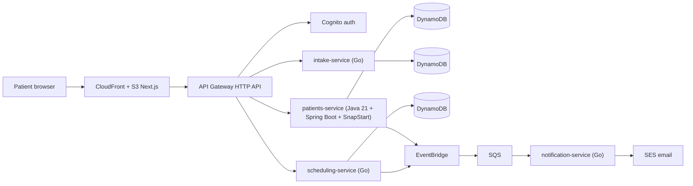

# LeveCare

> Doctor-guided weight-care telehealth for Brazil — a **portfolio demonstration project**. Not a real medical service.

Polyglot serverless microservices on AWS: **Java 21 + Spring Boot (SnapStart)** for the clinical core, **Go** for edge and event services, **Next.js** frontend on S3 + CloudFront, all provisioned with **AWS CDK** and deployed by **GitHub Actions (OIDC)**. Runs at **~$0/month** inside the AWS always-free tier.

## Live demo

| | |
|--|--|
| **Site** | [https://dc5s9mmmdrudy.cloudfront.net](https://dc5s9mmmdrudy.cloudfront.net) |
| **API** | `https://31yjtptfg8.execute-api.us-east-1.amazonaws.com` |
| **Region** | `us-east-1` (demo); production LGPD posture documented as `sa-east-1` |

**Try the flows:** landing → eligibility (`/pt/avaliacao`) → patient dashboard (`/pt/painel`) → mock booking (`/pt/agenda`). Create a Cognito account via **Sign up** on the dashboard (password ≥ 10 chars), confirm the email code, then sign in. There is no shared demo password.

English UI: `/en/…`.

## Architecture



Full details: [docs/architecture.md](docs/architecture.md) (ADRs, cost model) and [docs/productization.md](docs/productization.md) (Brazilian market, regulatory map, business model). Deploy bootstrap: [docs/deployment.md](docs/deployment.md).

## Repository layout

```
services/
  patients/       Java 21 + Spring Boot 3 — patients, LGPD consent, mock prescriptions
  go/
    intake/       Eligibility questionnaire scoring
    scheduling/   Provider slots and bookings
    notification/ SQS consumer → SES email
infra/            AWS CDK v2 (TypeScript)
web/              Next.js static export (PT-BR / EN)
docs/             Productization study, architecture, ADRs
scripts/          Docker-aware Go/Java build & test wrappers
```

## Local development & debugging

The backends are **AWS Lambda + DynamoDB + Cognito**—there is no all-in-one local API server. The practical loop is: **Next.js on localhost talking to the deployed API/Cognito**, plus **unit tests** for Go/Java before you push.

### 1. UI against the live API (day-to-day)

```bash
cd web && npm ci
# optional: cp .env.example .env.local  (demo Cognito/API defaults are already baked into code)
npm run dev
```

Open [http://localhost:3000/pt](http://localhost:3000/pt). Hot-reload covers landing, avaliação, agenda, and painel. Auth (Cognito), DynamoDB, and emails stay in AWS—so you can exercise the full patient journey without waiting for a frontend CloudFront deploy.

`NEXT_PUBLIC_*` can still override the baked-in demo API/Cognito IDs (see `web/.env.example`). Restart `npm run dev` after changing env files — Next only reads them at startup.

**End-to-end checklist on localhost:**

1. `/pt/avaliacao` → submit intake (email is saved in `sessionStorage`)
2. `/pt/agenda` → name/email prefilled; pick slot; sign in/up inline if needed; confirm booking
3. `/pt/painel` → patient auto-loads (or create once); grant LGPD consent; see consultations; issue/re-download demo Rx; cancel a booking

Emails go to the SES-sandbox verified inbox (not your Cognito email) until the account leaves sandbox.

### 2. Backend unit tests (no deploy)

**On the Mac:** Node.js 20+, Go 1.22+ and/or Docker Desktop, JDK 21 and/or Docker, AWS CLI (for deploy).

```bash
# All service tests (native tools, or Docker via scripts/with-*.sh)
./scripts/test-docker.sh

# Or separately:
cd services/go && go test ./...
cd services/patients && JAVA_HOME="$(brew --prefix openjdk@21)/libexec/openjdk.jdk/Contents/Home" mvn -q test

# Build Lambda artifacts (needed before cdk deploy)
./scripts/build-go.sh
./scripts/build-java.sh
```

### 3. Hit the API directly (curl)

Public routes need no auth. JWT routes need a Cognito ID token (easiest: sign in on localhost, copy `Authorization` from the browser Network tab).

```bash
API=https://31yjtptfg8.execute-api.us-east-1.amazonaws.com

# Public
curl -s "$API/slots" | jq .
curl -s -X POST "$API/intake" -H 'Content-Type: application/json' \
  -d '{"email":"you@example.com","age":35,"heightCm":170,"weightKg":95,"comorbidities":["hipertensao"],"pregnant":false,"eatingDisorderHistory":false}' | jq .

# JWT (paste token from browser)
TOKEN='…'
curl -s "$API/bookings" -H "Authorization: Bearer $TOKEN" | jq .
curl -s "$API/patients?email=you@example.com" -H "Authorization: Bearer $TOKEN" | jq .
```

### 4. Infra check without deploy

```bash
cd infra && npm ci && npx cdk synth
```

### Deploy

```bash
cd web && npm ci && npm run build && cd ..
cd infra && npm ci && npx cdk deploy --all
```

One-time CDK bootstrap + GitHub OIDC: [docs/deployment.md](docs/deployment.md). CI deploys on push to `main` — [.github/workflows/deploy.yml](.github/workflows/deploy.yml). For UI-only work, prefer `npm run dev` against the live API; push when you need backend/Lambda changes in AWS.

## Stack highlights

- **Polyglot serverless:** Java clinical core (SnapStart) + Go edge services on `provided.al2023` ARM64
- **Event-driven:** EventBridge → SQS → SES notifications (`levecare.*` sources)
- **Auth:** Cognito (email self-sign-up) + JWT on patient/booking routes
- **Frontend:** Next.js static export on S3 + CloudFront (AWS-hosted, not Vercel)
- **IaC / CI:** CDK TypeScript, GitHub Actions OIDC (no long-lived AWS keys)

## Cost guardrails

- Lambda, DynamoDB (on-demand), EventBridge, SQS, Cognito, CloudFront stay within always-free limits at demo traffic.
- No NAT gateway, no VPC-attached Lambdas, SES sandbox, 7-day log retention.
- AWS Budget alarm at $5/month is provisioned by the CDK stack.

## Disclaimer

LeveCare is a technical and product study. Screens, plans, prescriptions, and medical flows are **fictitious demonstrations**. Nothing here constitutes medical advice or a regulated health service. See the productization study for the real regulatory requirements (CFM 2.314/2022, ANVISA RDC 1.000/2025, SNCR, LGPD).
