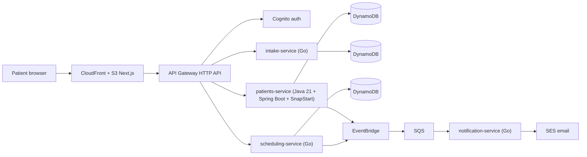

# LeveCare

> Doctor-guided weight-care telehealth for Brazil — a **portfolio demonstration project**. Not a real medical service.

Polyglot serverless microservices on AWS: **Java 21 + Spring Boot (SnapStart)** for the clinical core, **Go** for edge and event services, **Next.js** frontend on S3 + CloudFront, all provisioned with **AWS CDK** and deployed by **GitHub Actions (OIDC)**. Runs at **~$0/month** inside the AWS always-free tier.

## Live demo

| | |
|--|--|
| **Site** | [https://dc5s9mmmdrudy.cloudfront.net](https://dc5s9mmmdrudy.cloudfront.net) |
| **API** | `https://31yjtptfg8.execute-api.us-east-1.amazonaws.com` |
| **Region** | `us-east-1` (demo); production LGPD posture documented as `sa-east-1` |

**Try the flows:** landing → eligibility (`/pt/avaliacao`) → patient dashboard (`/pt/painel`) → mock booking (`/pt/agenda`). Create a Cognito account via **Sign up** on the dashboard (password ≥ 10 chars), confirm the email code, then sign in. There is no shared demo password.

English UI: `/en/…`.

## Architecture



Full details: [docs/architecture.md](docs/architecture.md) (ADRs, cost model) and [docs/productization.md](docs/productization.md) (Brazilian market, regulatory map, business model). Deploy bootstrap: [docs/deployment.md](docs/deployment.md).

## Repository layout

```
services/
  patients/       Java 21 + Spring Boot 3 — patients, LGPD consent, mock prescriptions
  go/
    intake/       Eligibility questionnaire scoring
    scheduling/   Provider slots and bookings
    notification/ SQS consumer → SES email
infra/            AWS CDK v2 (TypeScript)
web/              Next.js static export (PT-BR / EN)
docs/             Productization study, architecture, ADRs
scripts/          Docker-aware Go/Java build & test wrappers
```

## Local development

The backends are **AWS Lambda**—there is no local API process. Day to day you run the Next.js UI against the deployed API and Cognito.

```bash
cd web && npm ci

NEXT_PUBLIC_API_URL="https://31yjtptfg8.execute-api.us-east-1.amazonaws.com" \
NEXT_PUBLIC_USER_POOL_ID="us-east-1_H2UchxRAL" \
NEXT_PUBLIC_USER_POOL_CLIENT_ID="qm2hcuehjmf1ekksbr66s5evp" \
npm run dev
```

Open [http://localhost:3000](http://localhost:3000). Without the `NEXT_PUBLIC_*` vars, the API defaults to `http://localhost:3001` (nothing listens there).

### Build & test services (Docker-first)

**On the Mac:** Node.js 20+, Docker Desktop, AWS CLI (for deploy).

Go / Java run in containers when Docker is up (`golang:1.22`, `maven:3.9-eclipse-temurin-21`); native Go 1.22+ / Java 21 + Maven only if Docker is unavailable.

```bash
./scripts/build-go.sh
./scripts/build-java.sh
./scripts/test-docker.sh
```

### Deploy

```bash
cd web && npm ci && npm run build && cd ..
cd infra && npm ci && npx cdk deploy --all
```

One-time CDK bootstrap + GitHub OIDC: [docs/deployment.md](docs/deployment.md). CI deploys on push to `main` — [.github/workflows/deploy.yml](.github/workflows/deploy.yml).

## Stack highlights

- **Polyglot serverless:** Java clinical core (SnapStart) + Go edge services on `provided.al2023` ARM64
- **Event-driven:** EventBridge → SQS → SES notifications (`levecare.*` sources)
- **Auth:** Cognito (email self-sign-up) + JWT on patient/booking routes
- **Frontend:** Next.js static export on S3 + CloudFront (AWS-hosted, not Vercel)
- **IaC / CI:** CDK TypeScript, GitHub Actions OIDC (no long-lived AWS keys)

## Cost guardrails

- Lambda, DynamoDB (on-demand), EventBridge, SQS, Cognito, CloudFront stay within always-free limits at demo traffic.
- No NAT gateway, no VPC-attached Lambdas, SES sandbox, 7-day log retention.
- AWS Budget alarm at $5/month is provisioned by the CDK stack.

## Disclaimer

LeveCare is a technical and product study. Screens, plans, prescriptions, and medical flows are **fictitious demonstrations**. Nothing here constitutes medical advice or a regulated health service. See the productization study for the real regulatory requirements (CFM 2.314/2022, ANVISA RDC 1.000/2025, SNCR, LGPD).
