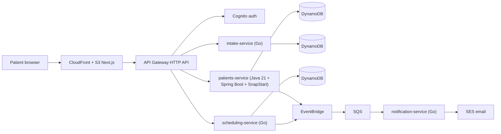

# LeveCare

> Doctor-guided weight-care telehealth for Brazil — a **portfolio demonstration project**. Not a real medical service.

Polyglot serverless microservices on AWS: **Java 21 + Spring Boot (SnapStart)** for the clinical core, **Go** for edge and event services, **Next.js** frontend on S3 + CloudFront, all provisioned with **AWS CDK** and deployed by **GitHub Actions (OIDC)**. Runs at **~$0/month** inside the AWS always-free tier.

## Architecture



Full details: [docs/architecture.md](docs/architecture.md) (ADRs, cost model) and [docs/productization.md](docs/productization.md) (Brazilian market, regulatory map, business model).

## Repository layout

```
services/
  patients/       Java 21 + Spring Boot 3 — patients, LGPD consent, mock prescriptions
  go/
    intake/       Eligibility questionnaire scoring
    scheduling/   Provider slots and bookings
    notification/ SQS consumer → SES email
infra/            AWS CDK v2 (TypeScript)
web/              Next.js static export (PT-BR / EN)
docs/             Productization study, architecture, ADRs
```

## Prerequisites

**On the Mac (native):**

- Node.js 20+
- Docker Desktop (for Go / Java builds when those toolchains are not installed)
- AWS account + AWS CLI configured (`aws sts get-caller-identity`)
- CDK bootstrap once per account/region — see [docs/deployment.md](docs/deployment.md)

**Go / Java:** Prefer Docker. `./scripts/build-go.sh`, `./scripts/build-java.sh`, and `./scripts/test-docker.sh` use `golang:1.22` and `maven:3.9-eclipse-temurin-21` when Docker Desktop is running (avoids host JDK mismatches). Native Go 1.22+ / Java 21 + Maven are used only if Docker is unavailable.

## Build & deploy

```bash
# Go + Java (Docker used automatically if go/mvn are not on PATH)
./scripts/build-go.sh
./scripts/build-java.sh

# Tests (same Docker fallback)
./scripts/test-docker.sh

# Frontend
cd web && npm ci && npm run build && cd ..

# Infra (deploys everything)
cd infra && npm ci && npx cdk deploy --all
```

One-time AWS OIDC + GitHub Actions setup: [docs/deployment.md](docs/deployment.md).

CI does the same on every push to `main` — see [.github/workflows/deploy.yml](.github/workflows/deploy.yml).

## Cost guardrails

- Lambda, DynamoDB (on-demand), EventBridge, SQS, Cognito, CloudFront stay within always-free limits at demo traffic.
- No NAT gateway, no VPC-attached Lambdas, SES sandbox, 7-day log retention.
- AWS Budget alarm at $5/month is provisioned by the CDK stack.

## Disclaimer

LeveCare is a technical and product study. Screens, plans, prescriptions, and medical flows are **fictitious demonstrations**. Nothing here constitutes medical advice or a regulated health service. See the productization study for the real regulatory requirements (CFM 2.314/2022, ANVISA RDC 1.000/2025, SNCR, LGPD).
