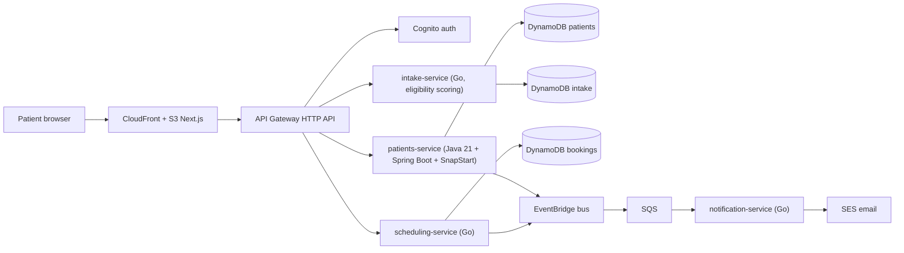

# LeveCare — Architecture

Serverless, event-driven, polyglot microservices on AWS. Everything scales to zero and stays inside the AWS always-free tier at demo traffic.

## System diagram

## Services

| Service | Language / runtime | Responsibility | Data |
|---------|--------------------|----------------|------|
| `patients-service` | Java 21, Spring Boot 3, Lambda + SnapStart | Patient records, LGPD consent capture, mock prescription issuance | `levecare-patients` table |
| `intake-service` | Go 1.x, `provided.al2023` ARM64 | Eligibility questionnaire scoring (BMI, comorbidities, exclusions) | `levecare-intake` table |
| `scheduling-service` | Go 1.x, `provided.al2023` ARM64 | Provider slots, booking lifecycle; emits `booking.confirmed` | `levecare-bookings` table |
| `notification-service` | Go 1.x, `provided.al2023` ARM64 | SQS consumer; sends transactional email via SES | — |

Routing (single HTTP API, path-based):

- `POST/GET /patients`, `POST /patients/{id}/consent`, `POST /patients/{id}/prescriptions` → patients-service (JWT-protected)
- `POST /intake` (public), `GET /intake/{id}` → intake-service
- `GET /slots`, `POST /bookings`, `GET /bookings/{id}` → scheduling-service (JWT-protected)

## Decision records

### ADR-001 — Serverless over containers

**Decision:** Lambda + API Gateway + DynamoDB rather than ECS/EKS/App Runner.

**Why:** portfolio/demo traffic is near zero; Lambda (1M req/mo) and DynamoDB (25 GB) are *always free*, whereas the cheapest always-on container setup costs ~$15–50/mo. Serverless is also the architecture a pre-revenue telehealth product would actually pick (scale-to-zero, per-request billing). Trade-off accepted: cold starts (mitigated below) and vendor coupling (acceptable for the product stage).

### ADR-002 — Java for the clinical core, Go for the edge

**Decision:** `patients-service` in Java 21 + Spring Boot; intake/scheduling/notification in Go.

**Why:**

- The clinical core benefits from the JVM ecosystem's depth — bean validation, auditing patterns, PDF generation, and future HL7/FHIR libraries — and Spring Boot mirrors the maturity a regulated domain demands. It also reinforces the primary stack signal (Java/Spring at senior level).
- Edge/event services (scoring, notifications) are small, hot-path functions where Go's ~20–50ms cold starts, tiny binaries, and low memory floor (128 MB) minimize cost and latency. Demonstrates deliberate polyglot judgment rather than one-language-everywhere.

### ADR-003 — SnapStart instead of provisioned concurrency for Java

**Decision:** Enable Lambda SnapStart on the Java function; no provisioned concurrency.

**Why:** Spring Boot cold starts of 2–5s drop to ~100–200ms with SnapStart at effectively zero cost (restore charge ~$0.0000015/restore); provisioned concurrency for the same effect costs ~$10+/mo per GB held warm. Constraint: SnapStart requires published function versions and zip packaging — CDK handles both.

### ADR-004 — DynamoDB single-table per service

**Decision:** One on-demand DynamoDB table per service, single-table design inside each.

**Why:** database-per-service preserves microservice ownership boundaries; single-table design within a service keeps access patterns O(1) and stays free (25 GB always-free, on-demand billing at zero when idle). Relational needs are minimal at MVP scope; no RDS avoids the largest fixed cost in the stack.

### ADR-005 — EventBridge + SQS for async workflows

**Decision:** Domain events (`intake.completed`, `booking.confirmed`, `prescription.issued`) on a custom EventBridge bus; notification consumption buffered through SQS.

**Why:** clinical workflows are event-shaped; EventBridge gives content-based routing and an audit-friendly event log, SQS adds retry/DLQ semantics for the email path. Both are always-free at demo volume.

### ADR-006 — Region sa-east-1 posture, deployed to us-east-1

**Decision:** Architecture documents **sa-east-1 (São Paulo)** as the production data-residency posture for LGPD; the demo deploys to **us-east-1** where free-tier pricing and service availability are broadest.

**Why:** LGPD does not strictly forbid international transfer but residency simplifies compliance narrative; for a $0 demo, us-east-1 is pragmatic. The region is a single CDK context value.

### ADR-007 — Next.js static export on S3 + CloudFront

**Decision:** `output: "export"` Next.js, S3 origin, CloudFront distribution with OAC.

**Why:** keeps the React/Next skill story while making the frontend an AWS artifact (unlike prior Vercel projects). No SSR needed — the app is a static shell over authenticated APIs. CloudFront's 1 TB/mo free tier covers it permanently.

### ADR-008 — CDK (TypeScript) + GitHub Actions OIDC

**Decision:** AWS CDK v2 in TypeScript, single `dev` stage; CI deploys via a GitHub OIDC-assumed IAM role.

**Why:** CDK aligns with AWS Builder Center workshop material and gives typed, testable infra; OIDC eliminates long-lived AWS keys in GitHub secrets. Trade-off: CDK bootstrap required once per account/region.

## Observability

- **Tracing:** X-Ray active tracing on API Gateway and all Lambdas.
- **Logs:** structured JSON — Logback JSON encoder (Java), `slog` (Go); CloudWatch retention 7 days everywhere.
- **Dashboard:** CloudWatch dashboard with per-service invocations, p95 duration, errors, DLQ depth.
- **Cost:** AWS Budget with $5/month alarm; no NAT gateways, no VPC attachment for Lambdas, SES sandbox only.

## Cost model (steady state, demo traffic)

| Service | Free-tier coverage | Expected |
|---------|--------------------|----------|
| Lambda | 1M req + 400K GB-s always free | $0 |
| DynamoDB | 25 GB + on-demand | $0 |
| API Gateway HTTP API | 1M req/mo free (12-mo), then $1.00/M | ~$0 |
| EventBridge / SQS / SES | Always free at this volume | $0 |
| S3 + CloudFront | 5 GB / 1 TB free | $0 |
| Cognito | Free ≤ 10k MAU | $0 |
| CloudWatch/X-Ray | Free tiers, 7-day retention | ~$0 |
| **Total** | | **~$0–1/mo** |
